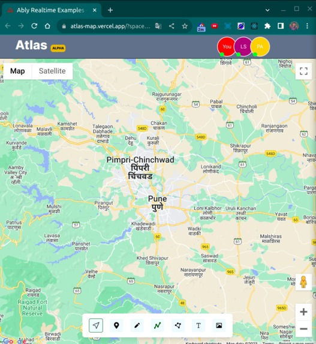

## Atlas

Alas is a realtime collaborative map. Users can make a map more interactive, informative and interesting by adding notes, images, pins, drawing lines and shapes on the map.

You can create a map, add elements to it and invite your friends to plan a trip, trek, survey or just to explore a place.

Create a map -> [https://atlas-map.vercel.app](https://atlas-map.vercel.app/)
  
  

## Built With

- React(vite)
- MongoDB
- ExpressJS
- Ably
- Google Maps API
- TailwindCSS

## What's Next

- more customization
- save images
- authentication
- Component Locking(allow only one user to edit a element at a time to avoid conflicts)
